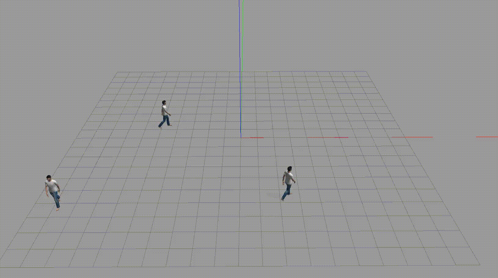

# 🧍‍♂️ Human Actor Plugin for Gazebo Classic

Bring your simulations to life!  
The `human_actor_plugin` is a lightweight and configurable Gazebo Classic plugin that lets you spawn and animate human-like actors in simulation — either along a predefined path or by streaming live pose commands from ROS.

  
*Give your robots someone to interact with!*

---

## 🚀 Features

- ✅ **ROS Integration** – control human pose via ROS topics
- 🧭 **Namespace & topic configurable** – spawn multiple humans with isolated control
- 🎯 **Real-time control** – command actor motion from a joystick, planner, or script
- 🔄 **Trajectory playback** – follow predefined paths (CSV, spline, etc.)
- 🛠️ **Minimal dependencies** – works with ROS Noetic and Gazebo Classic

---

## 📦 Installation

Clone this repo into your Catkin workspace:

```bash
cd ~/catkin_ws/src
git clone https://github.com/ARSControl/human_actor_plugin.git
cd ..
catkin_make
```

## 🧪 Usage

### 1. Launch Gazebo with your human model

`roslaunch human_actor_plugin demo.launch` 

This will:

-   Start Gazebo with a human model
    
-   Spawn the plugin
    
-   Subscribe to `/human_0/actor_pose` by default
    

### 2. Send it a pose


`rostopic pub /human_0/actor_pose geometry_msgs/PoseStamped \ '{ pose: { position: { x: 1.0, y: 2.0, z: 0.0 }, orientation: { w: 1.0 } } }'` 

----------

## ⚙️ Configuration

In your model's SDF or Xacro file:

```bash
    <plugin  name="human_actor_plugin"  filename="libhuman_actor_plugin.so"> 
        <ros_namespace>human_0</ros_namespace> 
        <ros_topic>actor_pose</ros_topic> 
    </plugin> 
```
These parameters allow multiple independent humans in the same simulation.

----------

## 📂 Folder Structure


`human_actor_plugin/
├── launch/ # Demo launch files ├── models/ # SDF/Xacro model of the human ├── src/ # Plugin source code ├── CMakeLists.txt
├── package.xml
└── README.md` 

----------

## 💡 Roadmap

-   Animation support (walk cycle)
    
-   Trajectory from CSV
    
-   Rviz marker control
    
-   Crowd simulation integration
    

----------

## 🤝 Contributing

Pull requests and issues are welcome!  
If you’ve made your human walk, run, or dance — show it off and open a PR 🕺💃


----------

## 👤 Author

**Your Name**  
GitHub: [@MatCat960](https://github.com/MatCat960)

----------

> **Tip:** Want to control humans with a joystick or from a path planner? This plugin plays nice with anything that publishes `PoseStamped`.